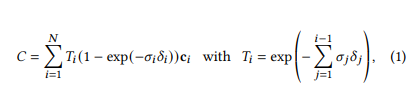
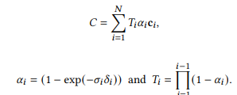
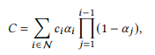
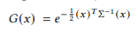
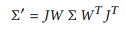
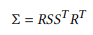
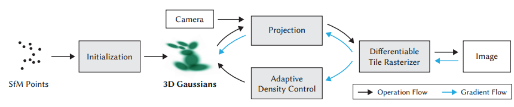
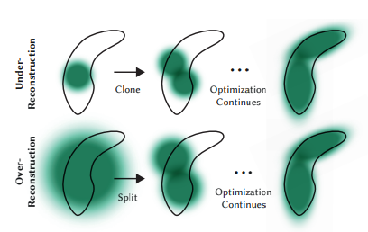
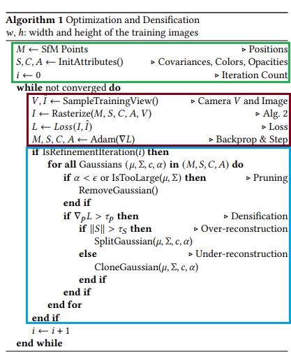

# 3D Gaussian Splatting for Real-Time Radiance Field Rendering

## 초록

### 방법
-  camera calibration 과정에서 얻는 3D point cloud를 초기값으로 사용하여 불필요한 연산제거
- 3D Gaussian의 interleaved optimization/density control(교차 최적화 및 밀도 제어)를 통한 anisotropic covariance(비등방성 공분산) 최적화
-  fast visibility-aware rendering algorithm을 통한 빠른 학습 및 실시간 렌더링

## Introduction

- Neural Radiance Field(NeRF)를 통한 novel views synthesizing 문제 해결 시 고품질 실시간 렌더링의 불가
- 1080p 고해상도에서의 실시간 렌더링(30fps 이상)과 동시에 최고 수준의 화질의 유지하는 3D Scene 렌더링
### 핵심
1. NeRF와 마찬가지로 Structure-from-Motion(SFM)을 입력으로 하여 생성된 3D point cloud를 이용하여 3D Gaussian 초기화, 이때 3D gaussian은 미분가능한 volumetric representation이며 효율적으로 2D에 rasterized
2. 3D Gaussian의 속성(3D 위치, 불투명도 𝛼, 비등방성 공분산, 구면 조화 계수(spherical harmonic)) 최적화, 적응형 밀도 제어와 결합하여 고품질 표현 생성
3. Tile-based rasterization에서 비롯한 fast GPU sorting algorithm

## Related Work

### Traditional Scene Reconstruction and Rendering
- Point Cloud, Mesh: 형태가 명확하여 GPU 래스터화에 매우 적합하고 속도가 빠름. 하지만 모델링 과정에서 빈 공간(hole)이나 불연속성이 발생하기 쉬워 고화질의 novel view synthesis에는 한계가 있음
### Neural Rendering and Radiance Fields
- NeRF의 등장: Volumetric ray-marching 방식의 도입과 MLP사용으로 최고 수준의 화질개선, 학습과 렌더링 속도가 극도로 느림
- 최신 고속화 연구: InstantNGP(해시 그리드와 점유 그리드
를 사용하여 계산 속도 증가), Plenoxels(희소 복셀 그리드를 사용하여 연속적인 밀도 필드를 보간하며, 신경망을 완전히 생략)
- 3D Gaussian Splatting의 차별점: ray-marching 시 발생하는 수많은 sampling 연산, grid 구조의 한계로 인한 빈 공간 표현의 취약을 대신하여 unconstructed, explicit 3d Gaussian을 사용하여 빠르고 높은 사양 표현
### Point-Based Rendering and Radiance Fields
- 기존의 point-based rendering은 점 사이에 빈 공간이 생기고, aliasing 현상과 더불어 불연속적이라는 단점 존재
- 점을 픽셀보다 확장하여 뿌리는 splatting을 연구
- point-based alpha-rendering과 NeRF의 volumetric rendering은 본질적으로 같은 이미지 형성 모델을 공유한다.

NeRF에서 volumetric rendering 시, 광선을 따라 밀도 σ, 투과율 T, 색상 c를 sampling 할 때 C는 위의 식과 동일하다. 

이때 $\alpha_i = (1 - \exp(-\sigma_i\delta_i))$로 치환 시 위와같이 줄일 수 있다.

또한 위의 식은 point-based alpha-blending의 수식으로 마찬가지로 $\mathcal{T}_i$로 치환 시 volumetirc rendering의 수식과 수학적으로 동일함을 알 수 있다.

## Differentiable 3D Gaussian Splatting

- 이때 위치(mean)이 μ, 공분산이∑를 의미
- 해당 Gaussian은 블렌딩 과정에서 alpha값이 곱해진다.

viewing transformation W가 주어졌을 때 카메라 좌표계에서의 공분산∑'
- J는 projective transformation의 affine approximation(아핀근사) Jacobian
- ∑'의 3번째 열과 행을 없애면 2x2행렬이며, 이는 J가 복잡한 projective transformation에서 간단한 아핀근사로 바꿔주는 행렬

- 공분산 행렬은 positive semi-definite일 경우에만 의미를 가짐. 공분산을 직접적으로 최적화 하는경우 해당 제약조건의 설정의 어려움 발생.
- 회전행렬 R와 스케일S를 이용하여 S를 위한 3D vector s, R을 위한 쿼터니언 q를 최적화 진행

## Optimization with Adaptive Density Control
최적화가 필요한 계수: 위치p, 불투명도 α, 공분산 ∑, 구면조화계수 (SH)

### Optimization
- 미분 가능한 rasterizer를 통해 이미지를 렌더링 후, 원본 이미지와의 Loss계산 후 계수 최적화
- Loss 함수는 L1 Loss와 D-SSIM Loss를 결합하여 사용, 본 논문에서 λ는 0.2 적용
$$\mathcal{L} = (1- \lambda) \mathcal{L}_1 + \lambda \mathcal{L}_{D-SSIM}$$

### Adaptive Density Control

- 초기 cloud point의 밀도가 균일하지 않기 때문에, 학습을 진행하여, 100번의 반복마다, Gaussian의 개수와 분포를 조절

- Clone: Under-Reconstruction의 경우 작은 Gaussian을 복제 이후 positional gradient 방향으로 이동

- Split: Pver-Reconstruction의 경우 해당 Gayssuab을 제거 이후, scale을 줄인 2개의 작은 Gaussian으로 분할

- Remove: 불투명도 α값이 임계값 이하로 떨어져 투명해진 Gaussian, 크기가 너무 커진 Gaussian은 주기적으로 제거하여 불필요한 연산 제거

## Fast Differentiable Rasterizer for Gaussians

### Tile-based Rasterization
- 무거운 Ray-marching대신, Gaussian을 2D 평면에 project하여 splatting방식을 최적화

    1. 화면을 16x16 타일로 분할
    2. 카메라 frustum과 각 타일에 대해 cull 진행(극단적 경계값에 대한 Gaussian 삭제)
    3.  각 Gaussian이 어느 타일에 겹치는지 식별 후 depth, ID를 할당
    4.  할당된 Key를 바탕으로 single fast GPU Radix sort를 이용하여 정렬
    5.  정렬된 가우시안들을 앞에서부터 뒤로(Front-to-back) 순차적으로 alpha blending 연산하여 픽셀의 최종 색상 결정

- 각 타일(블록)마다 독립적으로 병렬 처리가 가능하고 추가적인 메모리 할당 병목을 없애 기존 방식 대비 압도적인 렌더링 속도를 보장

## PseudoCode

- 녹색 부분은 Initialization 파트로 SFM으로 얻은 point cloud로 부터 3D Gaussian의 속성들을 정의
- 붉은 부분은 Projection을 통해 카메라 3D Gaussian을 2D Gaussian으로 변경 후, 이미지를 타일단위로 나누어 rasterization을 진행, Loss계산 후 전파
- 파란 부분은 Adaptive Density Control로 loss값을 줄이는 방향으로 Gaussian을 업데이트