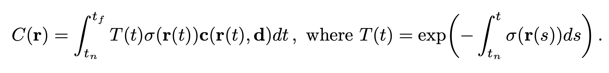
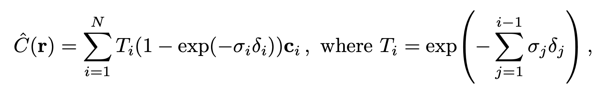
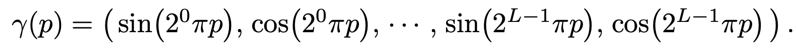
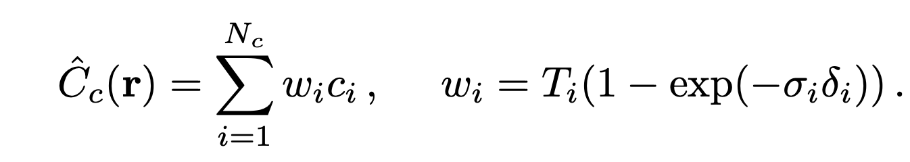
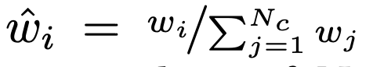
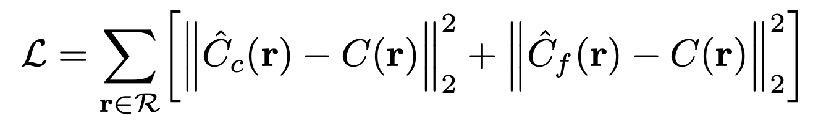

# 📌 Representing Scenes as Neural Radiance Fields for View Synthesis

## 0. 초록

### 🔹 목표
- 복잡한 장면에서 고수준의 novel views synthesizing

### 🔹 방법
- 주어진 input view들로 연속적인 공간을 학습(최적화) 시킴 -> Self-supervised learning
- MLP를 이용: (x, y, z, θ, φ) -> MLP -> (r, g, b, a)
- classic volume rendering techniques의 미분을 이용한 학습

---

## 1. Introduction

### 🔹 핵심 아이디어
1. 하나의 장면을 MLP로 구현된 함수로 표현함. (NeRF)
2. 함수는 (x, y, z, θ, φ)를 입력으로 받으면 (r, g, b, a)를 출력함.
3. ray tracing을 함수에 적용하면 특정 view에서의 색상을 얻어올 수 있음. (ray를 marching하면서 색을 누적하여 최종 색상을 결정)
4. ray tracing은 미분 가능하므로 주어진 이미지들을 이용하여 Self-supervised learning 가능. 

### 🔹 보충 장치
- 고해상도 표현을 위한 *positional encoding*
- ray를 marching 과정에서의 sampling 횟수를 줄이기 위한 hierarchical sampling

### 🔹 NeRF의 장점
- 복잡한 장면을 고수준으로 표현 가능
- 장면을 고해상도로 적은 메모리를 이용하여 저장

---

## 2. Related Work

### 🔹 공간 표현의 동향
1. 전통적인 3D 표현 방식
- Voxel grid: 공간을 격자로 쪼갬, 메모리 많이 씀, 해상도 제한
- Mesh: 정점 + 삼각형, 표면 중심 표현, 위상 변화 어려움.

2. Implicit representation 방식
- 공간 좌표를 입력으로 받고 signed distance를 출력하는 함수 형태: fθ​(x,y,z)=s

    - fθ​(x,y,z) < 0: 물체 내부
    - fθ​(x,y,z) = 0: 물체 표면
    - fθ​(x,y,z) > 0: 물체 외부

- 표면이 어디인가?에 집중하는 방식.
- 복잡한 장면을 표현하지 못함. 

### 🔹 Neural 3D shape representations
- 초기에는 공간 좌표를 입력받아 signed distance를 출력하는 함수 형태: fθ​(x,y,z)=s
 -> 학습을 위해서는 3차원 labeling이 필요함. 특정 좌표(x, y, z)의 signed distance를 알아야지 학습 가능.
- 미분 가능한 rendering 함수를 만들어서 3차원 이미지만 가지고 학습이 가능해짐.
 1. Niemeyer: 3D occupancy fields로부터 ray가 표면에 닿는 좌표를 찾아 해당 좌표에서의 색 추정함.
 2. Sitzmann: 장면을 “연속 3D 좌표 → feature(+RGB)”로 주는 MLP로 표현. 렌더링할 때는 RNN(LSTM)이 ray를 따라 표면을 찾아가며 색을 만듦
 * 이런 표면-탐색 계열은 실제 복잡한 장면에서 기하/디테일이 매끈해지는(oversmooth) 경향이 있음.

### 🔹 View synthesis and image-based rendering
- 이미지가 충분할 때: 
 Light Field Sample Interpolation: 광선을 보간해서 novel views synthesizing.

- 이미지가 충분하기 않을 때
 1. mesh-based representations of scenes
  - vertices, faces로 구성된 표면 표현 방식.
  - rendering이 비연속적이어서 gradient 계산이 어려움.
  - Differentiable rasterizer, Differentiable path tracer는 optimization이 불안정
  - gradient descent가 잘 안 됨. Topology 고정
 2. volumetric representations of scenes
  - 초기: voxel grid 직접 색칠
  - 딥러닝: 이미지 → voxel grid 예측
  - CNN + voxel 결합 (이건 개인적으로 뭔지 잘 모르겠음)
  - NeRF: voxel 대신 continuous function
   -> 메모리와 해상도 문제를 동시에 해결

## 3. Neural Radiance Field Scene Representation

### 🔹 NeRF
 - MLP network FΘ : (x,d) →(c,σ)
  -> Θ를 x, d를 받아서 올바른 c, σ를 출력하도록 최적화시킴.
 - 일관성 보장을 위하여 σ는 x만 이용하여 출력, c는 x, d 모두 이용하여 출력. 

 x -> |||||||| -> σ / feature-vector
                  d + feature-vector -> | -> c
                 
## 4. Volume Rendering with Radiance Fields

### 🔹 classical volume rendering

작은 구간 ds에서 죽을 확률은 밀도와 비례: σ * ds
 -> 살아남을 확률: 1 - σ * ds
구간 0 ~ s를 n개로 쪼개면 0 ~ s에서 살아남을 확률 T(s) = ∏(1−σds) 
ln T(s) = ln ∏(1−σds) = ∑​ ln(1−σds) 
이때 n이 무한이 크면 ln(1−σds)이 -σds로 수렴함. 즉, ln T(s) = ∑​ (-σds)
 T(s) = exp(-∑​ (σds)) = exp(−∫σds)

 ### 🔹 numerical method for intergral

 #### stratified sampling approach
  - N개의 균일 간격의로 ray path를 나누고 각각의 bin에서 random 위치의 sample을 뽑음. 
   -> 모델이 동일 좌표에서만 학습하는 것을 방지함. 연속적인 장면 표현을 가능하게 함.

## 5. Optimizing a Neural Radiance Field

### 🔹 Positional encoding
 - 인공 신경망은 저해상도를 학습하도록 치우쳐져 있음. (Rahaman) 
 - 고해상도 구조/ 색을 표현하지 못하는 한계를 개선
 - FΘ = F′Θ ◦γ 로 정의함. 여기서 γ은 차원을 R에서 R^2L로 전환. 학습 대상 x.

### 🔹 Hierarchical volume sampling
 - stratified sampling approach는 빈 공간과 밀도 있는 공간에서 동일하게 sampling하는 한계가 있음. 
 - Hierarchical volume sampling: 최종 결과에 영향을 미치는 비율을 고려하여 sampling을 하는 방식

    1. stratified sampling으로 ray 위에서 Nc 개의 샘플을 뽑고, coarse model을 사용해 이 위치들을 이용한 색을 계산.
    2. 위 식을 이용해서 각각의 위치에서 상호작용할 확률을 구함. -> sample point distribution이 됨. 
    3. inverse transform sampling을 통해서 Nf 개의 샘플을 뽑음. 
    4. Nc + Nf개의 샘플을 이용해서 fine 모델을 학습 시킴. 

### 🔹 Implementation details
 - 두개의 model(coarse/ fine)을 각각 학습시킴.
 - RGB image, camera pose, intrinsic parameters(카메라 내부 변수)가 필요. 
 - 현실에서는 COLMAP을 이용하여 camera pose 추정.

 - 다음 loss function을 이용하여 학습. R은 ray들의 집합.
 - 한 batch 안에서 coarse → fine 순서로 forward 계산하고, 동시에 둘 다 업데이트

## 6. Results

## 7. Conclusion